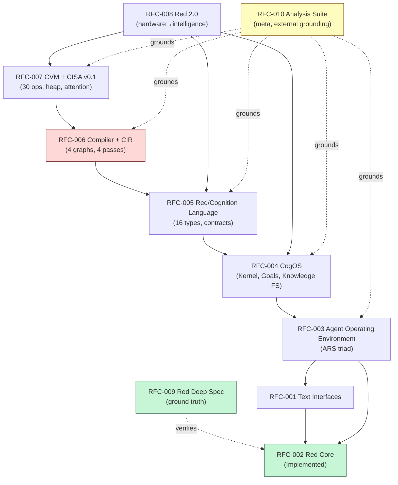
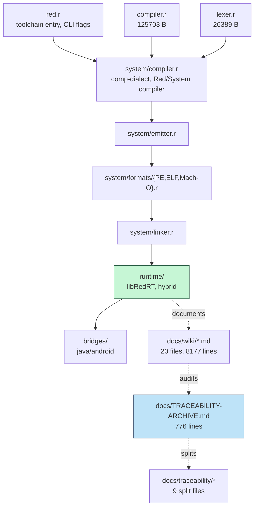

# Dependency Graph — Phase 4.5

> Master Source: `docs/TRACEABILITY-ARCHIVE.md` §4.5. Both conceptual (RFC-level) and technical (file-level) graphs. Arrows read `A → B` = `A depends on B` or `A is upstream of B` where noted.

## 6.1 Conceptual Dependency (RFC-level)



**Cycle analysis:** Acyclic. Centrality: **RFC-005** (Language) — bridges CogOS and Compiler/CVM. **Cut vertex: RFC-006 (Compiler)** — without it, CVM has no CIR to execute; roadmap critical path transits RFC-006. **RFC-010** is meta-grounding, not on critical path.

**Textual edge list (for auditability, same as master):**

```
RFC-002 Red Core (Implemented)
      │
      ├─► RFC-001 Text Interfaces (lifecycle)
      │       │
      │       └─► RFC-003 Agent Operating Environment (ARS triad)
      │               │
      │               ├─► RFC-004 CogOS (kernel, goals, knowledge FS, uncertainty) ──┐
      │               │       │                                                      │
      │               │       └─► RFC-005 Red/Cognition Language (16 types, contracts) │
      │               │               │                                              │
      │               │               └─► RFC-006 Compiler + CIR (4 graphs, 4 passes)  │
      │               │                       │                                    │
      │               │                       └─► RFC-007 CVM + CISA (30 ops, heap, attention) │
      │               │                               │                            │
      │               └───────────────────────────────┴─► RFC-008 Red 2.0 (unified hardware→intelligence)
      │                                                       │
      └───────────────────────────────────────────────────────┘
                                                              │
RFC-009 Red Deep Spec (ground truth, verifies RFC-002) ──────┘

RFC-010 Analysis Suite (meta, grounds RFC-003→007 externally)
```

## 6.2 Technical Artifact Dependency (file/component-level)



**Cognitive extension dependencies (proposed, no files yet — derived from RFC-005→007):**

```
red/cognition/types/ (goal! plan! belief! ... 16 types) ─┐
red/cognition/dialects/ (reason, plan, observe, remember) ├──► red/cognition/compiler/ (Intent/Effect/Capability/Planning/Optimisation)
red/cognition/contracts/ (Cognitive Pipe, Capability Binding) ─┘         │
                                                                           ▼
                                                                  CIR (cir.r) — Intent Graph → Task DAG → Capability Graph → Exec Graph
                                                                           │
cvm/ (cisa.r, registers.r, heap.r, attention.r, provenance.r) ◄────────────┘
      │
cogos/ (kernel.r, scheduler.r, memory.r, policy.r, model.r) ◄──────────────┘
```

**External ecosystem deps (open, OP-01):** `MCP gateway` · `vector DB` · `LLM provider SDK` · `Graphiti/Zep` · `libRedRT-exports.r`

## 6.3 Dependency Strength & Risk

| Edge | Dependency Strength | Failure If Upstream Missing | Mitigation |
|------|----------------------|-----------------------------|------------|
| RFC-002 → RFC-003..008 (Red Core → all cognitive RFCs) | **Strong / Blocking** | Entire cognitive stack has no substrate | Phases -1/0 already verify Red Core at `9b5b15a` |
| RFC-005 → RFC-006 (Language → Compiler) | Strong | CIR emission undefined without types | Phase 1 type MVP before compiler work |
| RFC-006 → RFC-007 (Compiler → CVM) | **Critical path** | CVM has no verifiable artifact to execute | Gate A: DAG must be valid before CVM work starts |
| RFC-010 → RFC-003..007 (Analyses ground RFCs) | Weak (justification, not implementation) | Architecture ungrounded but implementable | Already captured in docs/wiki analyses |
| Red Core file deps `red.r→compiler.r→system/*→runtime` | Strong | Toolchain broken | CI matrix (`MSDOS`..`Android-x86`) guards |

*Provenance: conceptual edges derived from §02-RFC-Origin-Map conversation→RFC chain; technical edges verified against actual repo `ls`/`compiler.r` size/`system/formats/` inventory.*
